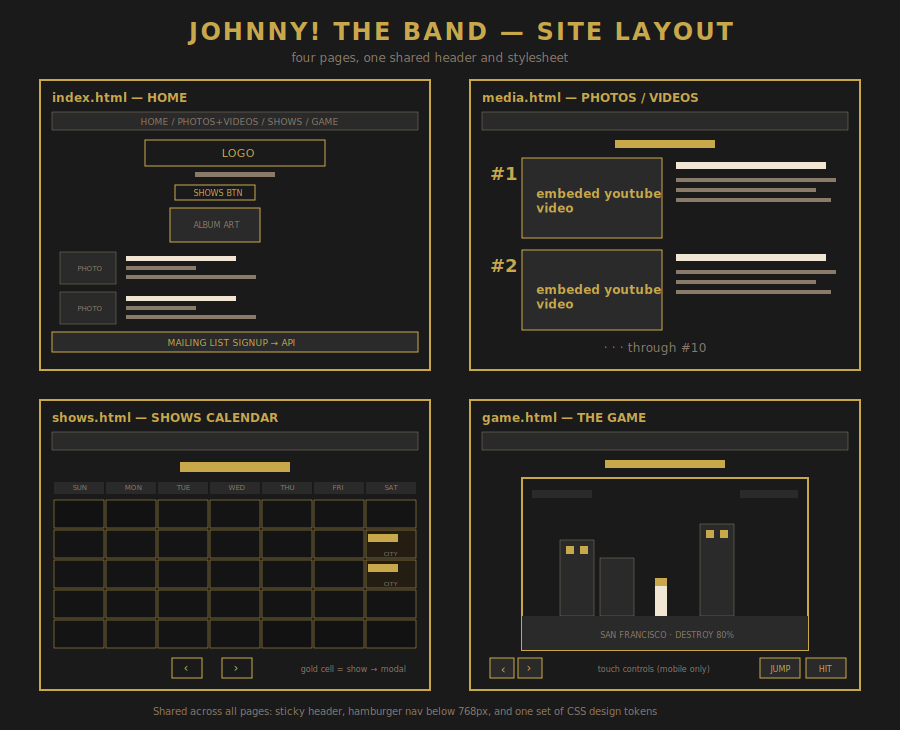

# Johnny! The Band

A live website for **Johnny!**, a San Francisco punk / power-pop band.

**Live site:** [johnnytheband.com](https://johnnytheband.com)

---

## Overview

This is a real, in-use website for a working band. It was built from scratch as a static front end backed by a small Node/Express API, and it is deployed and serving traffic on a custom domain.

The visual direction is a retro punk-zine aesthetic: monospace type, near-black paper, cream text, and a gold accent, with slightly rotated band photos and a hand-assembled calendar grid that reads like printed newsprint.

The band is Johnny TL (bass, vocals), Shreddin' Evan (guitars, vocals), and Petey (drums).

---

## Layout



The site is four pages sharing one sticky header, one nav, and one stylesheet of design tokens:

| Page             | File         | Purpose
| ---------------- | ------------ | ------------------------------------------------------------
| Home             | `index.html` | Hero, album teaser, band member bios, mailing-list signup
| Photos / Videos  | `media.html` | Top 10 songs, each with an embedded video
| Shows            | `shows.html` | Interactive tour calendar
| Game             | `game.html`  | Playable browser game

---

## Features

**Site-wide**

- Responsive layout with a single 768px breakpoint shared across every stylesheet
- Hamburger navigation on mobile, driven by a CSS class toggle with `aria-expanded` kept in sync
- Design tokens (colour, spacing, typography) defined once as CSS custom properties in `:root`
- Sticky header and a shared `.container` that controls page width in one place

**Mailing list signup**

- Front-end form posts to a live Express API rather than a form service
- Email addresses are stored in MongoDB Atlas, lowercased and timestamped
- Duplicate signups are rejected with a `409` before any write occurs
- The submit button disables on send, preventing double submission from a fast second click
- A welcome email sends automatically through Brevo, styled to match the site
- New subscribers are also synced to a Brevo contact list for newsletter sends
- Email failures are caught and logged rather than thrown

**Shows calendar**

- Month grid built entirely from JavaScript date arithmetic
- Correctly handles variable month lengths, leading and trailing spillover days
- Show data is loaded from `shows.json` and indexed by date
- Clicking a show opens a modal with venue, time, price, age limit, lineup, and notes
- Modal closes on the X button, on backdrop click, and on `Escape`
- Empty days are decorated with filler artwork chosen by a seeded pseudo-random generator


**Photos / videos**

- Videos use a click-to-load facade: a thumbnail image stands in for the player until clicked
- This avoids loading ten embedded players on page load, which would otherwise mean ten sets of third-party scripts and cookies before the visitor has watched anything
- On click, the facade is replaced in place by an autoplaying iframe that inherits the button's accessible label

**Game — "Johnny! Takes San Francisco"**

A destruction game built with Kaplay, played across three San Francisco neighbourhoods — the Mission, the Haight, and the Tenderloin — with each of the three band members playable.

- **The game ships with no asset files.** Every sprite is drawn pixel by pixel in JavaScript onto an offscreen canvas and converted to a data URL at load time
- Every sound effect is likewise synthesized into a WAV data URL at load, so the game makes no network requests for media of any kind
- Five scenes: character select, play, level clear, win, and game over with score carried between levels
- Destructible buildings with per-block health
- Player health, punch reach and cooldown, damage cooldown, and scoring for both blocks and NPCs
- Full on-screen touch controls on mobile, with real multi-touch handling: a thumb sliding between buttons re-targets correctly, and a button releases properly even when the finger lifts off the control bar entirely
- Landscape mode moves the controls into the side margins so nothing covers the play field
- All input routes through named virtual buttons, so keyboard and touch share a single code path inside the game
- The canvas is letterboxed to hold its 800×500 ratio at any screen size, which also keeps pointer coordinates accurate

---

## Tech stack

**Front end**

- HTML5, CSS3, JavaScript
- CSS Grid and Flexbox for layout, CSS custom properties for theming
- [Kaplay](https://kaplayjs.com/) for the browser game, with all sprites and sound effects generated procedurally at runtime rather than loaded as files

**Back end**

- Node.js with Express 5
- MongoDB Atlas for subscriber storage
- Brevo for transactional email and newsletter delivery
- `cors` and `dotenv`

**Infrastructure**

- Render — static site for the front end, separate web service for the API
- Namecheap — domain registration and DNS
- All credentials held in environment variables; nothing sensitive is committed

---

## Project structure

```
johnny-site/
├── css/
│   ├── style.css          design tokens, layout, nav, footer
│   ├── calendar.css       calendar grid and modal
│   └── media.css          video rows
├── js/
│   ├── nav.js             mobile hamburger toggle
│   ├── signup.js          signup form submission
│   ├── calendar.js        calendar rendering and date math
│   ├── media.js           click-to-load video facades
│   ├── game.js            game logic
│   ├── touch-controls.js  on-screen controls for touch devices
│   └── audio.js           sound playback and mute state
├── images/
├── server/
│   ├── server.js          Express API
│   └── package.json
├── index.html
├── media.html
├── shows.html
├── game.html
├── shows.json             tour dates
└── filler.json            calendar filler artwork manifest
```

---

## Running locally

The front end is static and needs no build step.

```bash
git clone https://github.com/mambo-sun/johnny-site.git
cd johnny-site
```

Note: Serve the root directory over HTTP.
      Opening `index.html` directly with `file://` will cause the signup request to be blocked by CORS.

```bash
python3 -m http.server 5500
```

To run the API as well:

```bash
cd server
npm install
node server.js
```

The API expects a `.env` file in `server/` containing `MONGO_URI`, `BREVO_API_KEY`, `BREVO_SENDER_NAME`, `BREVO_SENDER_EMAIL`, and `BREVO_LIST_ID`.
This file is not committed.

---

## Author

Michael Tashjian — [@mambo-sun](https://github.com/mambo-sun)
